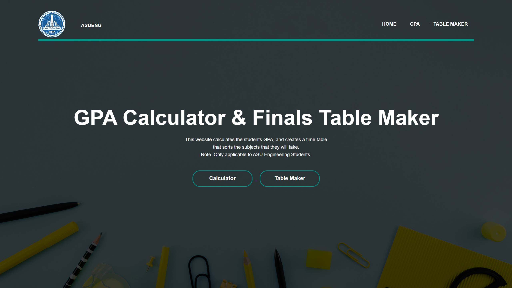
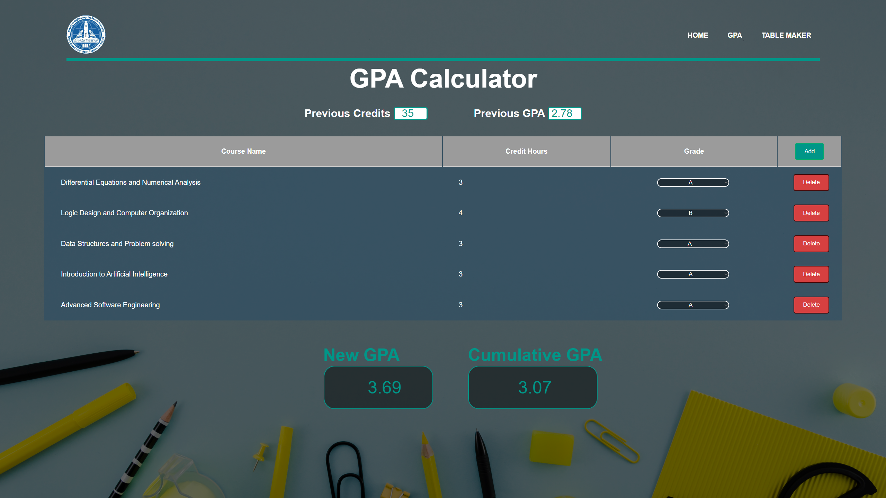
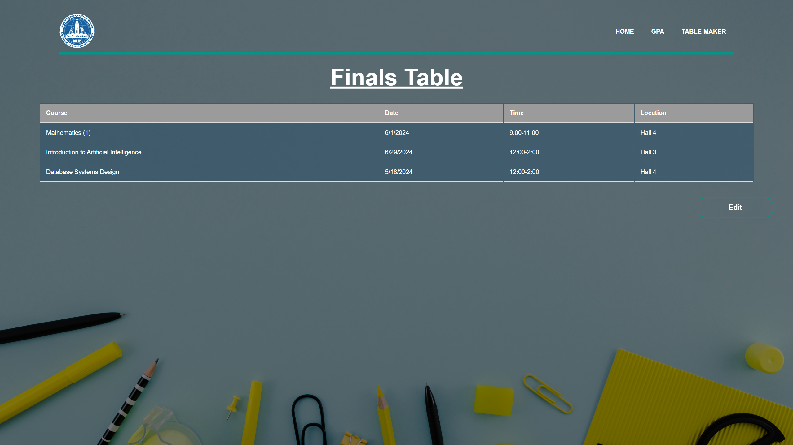
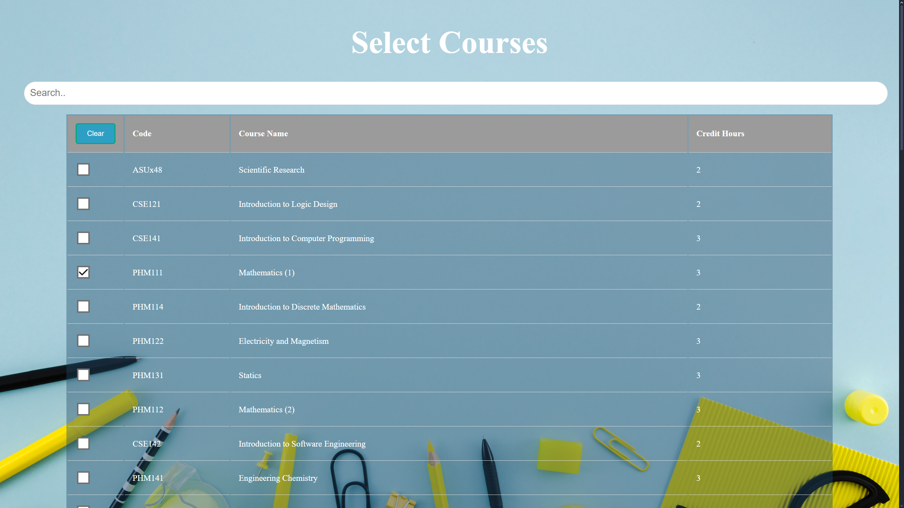

# Faculty of Engineering - ASU Tools

> **Project for Course: CSE142 - Introduction to Software Engineering  - 2024**

---

## Table of Contents
1. [About the Project](#about-the-project)
2. [Features](#features)
3. [Usage](#usage)
4. [Requirements](#requirements)
---

## About the Project
> This project is a web application designed specifically for ASU Engineering students to streamline their academic planning. It provides two core functionalities:

**GPA Calculator**: Calculates a student's Grade Point Average (**GPA**) based on their grades.

**Finals Table Maker**: Generates a well-organized timetable for final exams, sorting the subjects they need to take.

---

## Features
**GPA Calculation:**
- Simple and accurate GPA computation based on user inputs.
- Supports standard grading scales used in ASU Engineering.

**Finals Timetable Generator:**

- Automatically creates a clear and easy-to-follow timetable.

**Selection Page**
- Allows students to select their enrolled courses.
- Features a search engine on Course name for convenience

---
## Usage
Navigate to the homepage to select either the GPA Calculator or the Finals Table Maker.
Enter your data (grades, courses, exam dates).
View your calculated GPA or generated timetable.
## Requirements
This application is tailored for ASU Engineering students but can be adapted for other uses, can be improved to include adaptive schedules from Excel CSV Files.
## Homepage

## GPA Calculator

## Table Page

## Selection Page
